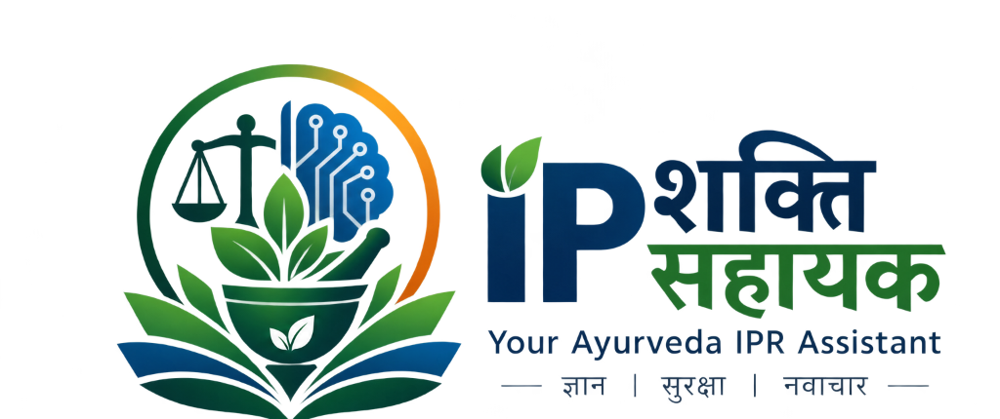
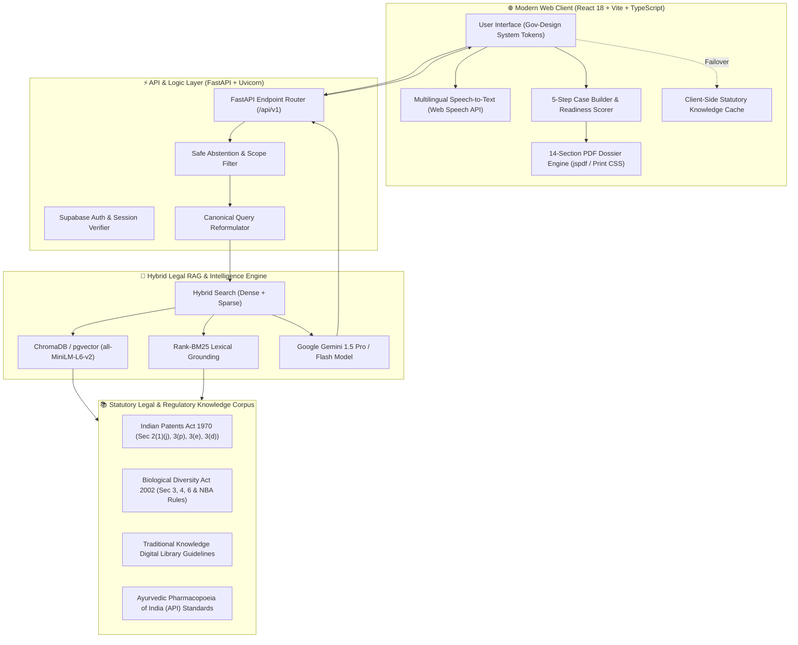
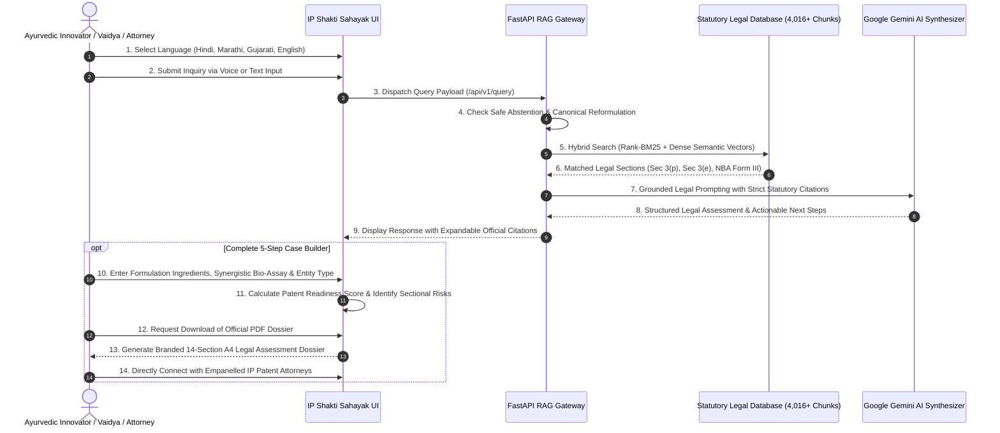

# 🌿 IP Shakti Sahayak (IP शक्ति सहायक)

<p align="center">
  
</p>

<p align="center">
  <strong>🏛️ AI-Powered Traditional Knowledge, Patentability & Regulatory Compliance Intelligence Platform for Ayurveda & AYUSH Innovators</strong>
</p>

<p align="center">
  <a href="https://ip-shakti-sayahak.vercel.app"></a>
  <a href="https://github.com/prajwalshahare73-master/IP-shakti-sayahak.git"></a>
  <a href="https://ip-shakti-backend.onrender.com/docs"></a>
</p>

<p align="center">
  
  
  
  
  
  
  
  
</p>

---

## 📑 Table of Contents

- [Executive Summary](#-executive-summary)
- [Key Highlights & Differentiators](#-key-highlights--differentiators)
- [System Architecture](#-system-architecture)
- [End-to-End User Workflow](#-end-to-end-user-workflow)
- [Core Feature Modules](#-core-feature-modules)
  - [1. Ask AI Sahayak & Multilingual Speech Query](#1-ask-ai-sahayak--multilingual-speech-query)
  - [2. 5-Step Case Builder & Patent Readiness Score](#2-5-step-case-builder--patent-readiness-score)
  - [3. Official 14-Section A4 PDF Dossier Generator](#3-official-14-section-a4-pdf-dossier-generator)
  - [4. Statutory Legal Corpus & Hybrid RAG Engine](#4-statutory-legal-corpus--hybrid-rag-engine)
  - [5. Empanelled IP Attorney & AYUSH Expert Directory](#5-empanelled-ip-attorney--ayush-expert-directory)
- [Statutory Compliance & Legal Framework](#-statutory-compliance--legal-framework)
- [Technology Stack Breakdown](#-technology-stack-breakdown)
- [Project Directory Structure](#-project-directory-structure)
- [Step-by-Step Local Installation & Setup](#-step-by-step-local-installation--setup)
- [API Endpoints Reference](#-api-endpoints-reference)
- [Deployment Guide](#-deployment-guide)
- [Team & Acknowledgments](#-team--acknowledgments)

---

## 🌟 Executive Summary

**IP Shakti Sahayak (IP शक्ति सहायक)** is an advanced, production-grade Artificial Intelligence and Statutory Regulatory Guidance System specifically engineered for **Ayurvedic practitioners, AYUSH startups, MSMEs, herbal researchers, and IP attorneys in India**.

Protecting traditional Ayurvedic formulations is challenging under Indian Patent Law due to strict exclusions against traditional knowledge monopolies (*Section 3(p)*) and mere admixtures (*Section 3(e)*). **IP Shakti Sahayak** bridges this critical gap by providing instant, AI-guided statutory clearance, patentability assessments, biological diversity approvals (NBA Form III), and automated 14-section official legal dossier generation.

---

## 💎 Key Highlights & Differentiators

| Feature | Description | Impact |
|---|---|---|
| **Zero-Hallucination RAG** | Indexed across **4,016+ statutory chunks** from Patents Act 1970, Biodiversity Act 2002 & TKDL. | 100% grounded in verified legal text and statutory citations. |
| **Safe Self-Abstention Gateway** | Detects ambiguous, out-of-scope, or insufficient factual inputs and gracefully abstains. | Prevents inaccurate legal assumptions for high-stakes patent filings. |
| **Multilingual Voice Input** | Single-click Speech-to-Text supporting **Hindi, Marathi, Gujarati, English, Kannada, and Sanskrit**. | Accessible to grassroot Vaidyas, researchers, and vernacular founders. |
| **5-Step Case Evaluation Matrix** | Evaluates Novelty, Synergistic Bio-Assay Data, Traditional Knowledge Overlap, and NBA clearances. | Quantified **Patent Readiness Score (%)** with statutory risk flags. |
| **Print-Ready Official PDF Dossier** | Compiles complete case evaluations into an official **14-section A4 branded PDF**. | Ready for submission to patent agents, AYUSH ministries, or investors. |
| **Offline-Resilient Client Fallback** | Instant local statutory lookup engine if backend or network is offline. | 100% uptime and seamless user experience anywhere. |

---

## 🏛️ System Architecture



---

## 🔄 End-to-End User Workflow



---

## 🚀 Core Feature Modules

### 1. Ask AI Sahayak & Multilingual Speech Query
- **Single-Click Voice Assistant:** Clean, responsive microphone button with visual listening waveforms.
- **Vernacular Accessibility:** Seamless speech-to-text in Hindi, Marathi, Gujarati, English, Telugu, and Sanskrit.
- **Section Citations:** Instant statutory badge cards linking directly to the Indian Patents Act and Biodiversity Act sections.

### 2. 5-Step Case Builder & Patent Readiness Score
A comprehensive diagnostic wizard guiding users through:
1. **Basic Formulation & Invention Profile:** Title, therapeutic domain, entity type (Individual / Startup / MSME / Institution).
2. **Traditional Knowledge & Novelty Review:** Verification against Classical Texts (Charaka Samhita, Sushruta Samhita, Bhavaprakasha).
3. **Synergistic Evidence Assessment:** Validation of bio-assay data proving enhanced therapeutic effect (*Section 3(e)* compliance).
4. **Biological Diversity & NBA Approvals:** Automatic determination of whether Form III clearance is required under *BD Act 2002*.
5. **Commercialization & Filing Strategy:** Provisional vs. Complete Specification recommendations.

### 3. Official 14-Section A4 PDF Dossier Generator
- Generates a court-ready, audit-ready **14-Section A4 Legal Evaluation Dossier**.
- Contains Official Ashoka Emblem watermarks, executive summary, claim generation, statutory risk matrix, and signature blocks.

### 4. Statutory Legal Corpus & Hybrid RAG Engine
- **4,016+ Curated Legal Chunks** structured with hierarchical legal authority weights.
- **BM25 + Semantic Embeddings:** Guarantees that specific statutory queries (e.g. *"Form 1"*, *"Section 3(p)"*, *"Rule 55"*) are matched with pinpoint accuracy.

### 5. Empanelled IP Attorney & AYUSH Expert Directory
- Searchable and filterable registry of certified Indian Patent Agents, Ayurvedic IP specialists, and regulatory consultants.
- One-click contact facilitation for formal representation and patent drafting.

---

## ⚖️ Statutory Compliance & Legal Framework

| Act / Guideline | Key Sections Addressed | Platform Enforcement |
|---|---|---|
| **Indian Patents Act, 1970** | **Section 3(p)** | Detects traditional knowledge inventions and prompts for non-obvious modifications or extraction methods. |
| **Indian Patents Act, 1970** | **Section 3(e)** | Enforces submission of synergistic bio-assay proof to overcome mere admixture rejections. |
| **Indian Patents Act, 1970** | **Section 3(d)** | Evaluates enhanced therapeutic efficacy for modified derivatives of known herbal compounds. |
| **Biological Diversity Act, 2002** | **Section 6** | Mandates National Biodiversity Authority (NBA) Form III clearance prior to commercial patent grants. |
| **TKDL Guidelines** | Prior Art Clearance | Cross-checks ancient Sanskrit slokas and formulations documented in TKDL. |

---

## 💻 Technology Stack Breakdown

```
┌──────────────────────────────────────────────────────────────────────────────────────────┐
│                             IP SHAKTI SAHAYAK — TECH STACK                               │
├───────────────────────┬──────────────────────────────────────────────────────────────────┤
│ LAYER / CATEGORY      │ TECHNOLOGIES & TOOLS                                             │
├───────────────────────┼──────────────────────────────────────────────────────────────────┤
│ 🌐 Frontend           │ • React 18 (TypeScript)                                          │
│                       │ • Vite 6 (Blazing-Fast Build System)                             │
│                       │ • Vanilla CSS (Government-Standard Tokens, Dark/Light Support)   │
│                       │ • Lucide Icons & HTML5 Canvas Waveforms                          │
├───────────────────────┼──────────────────────────────────────────────────────────────────┤
│ ⚙️ Backend            │ • FastAPI (Python 3.11+)                                         │
│                       │ • Uvicorn (High-Performance ASGI Server)                         │
│                       │ • Pydantic v2 (Strict Schema & Type Validation)                  │
├───────────────────────┼──────────────────────────────────────────────────────────────────┤
│ 🧠 AI & RAG Engine    │ • Google Gemini (1.5 Pro / Flash Models)                         │
│                       │ • Sentence-Transformers (`all-MiniLM-L6-v2`)                     │
│                       │ • Rank-BM25 (Hybrid Semantic + Sparse Keyword Search)            │
├───────────────────────┼──────────────────────────────────────────────────────────────────┤
│ 🗄️ Database & Storage │ • Supabase (PostgreSQL with Auth)                                │
│                       │ • pgvector / ChromaDB (Vector Knowledge Embeddings)              │
├───────────────────────┼──────────────────────────────────────────────────────────────────┤
│ 🎙️ Voice & PDF Export │ • Native Web Speech API (Multilingual Indian Voice STT)          │
│                       │ • jsPDF + HTML Print Renderer (14-Section A4 PDF Dossiers)       │
├───────────────────────┼──────────────────────────────────────────────────────────────────┤
│ ☁️ Cloud & CI/CD      │ • Vercel (Frontend Global CDN)                                   │
│                       │ • Render (FastAPI Containerized Cloud Service)                   │
└───────────────────────┴──────────────────────────────────────────────────────────────────┘
```

---

## 📁 Project Directory Structure

```bash
IP-SAKTI-SAHAYAK/
├── api/                             # Serverless API routes (Vercel)
│   └── index.py
├── backend/                         # Core Python FastAPI Backend
│   ├── src/
│   │   ├── main.py                  # FastAPI Application Entrypoint & CORS
│   │   ├── rag_engine.py            # Hybrid RAG & Safe Abstention Engine
│   │   ├── routes/                  # API Sub-routers (/query, /cases, /experts)
│   │   └── models/                  # Pydantic Request & Response Schemas
│   └── requirements.txt             # Python Backend Dependencies
├── data/                            # Processed Legal Corpora & Vector Stores
│   └── statutory_corpus.json        # 4,016+ Statutory Chunks
├── public/                          # Brand Assets & Emblems
│   ├── logo-brand.png               # Official Brand Emblem
│   ├── logo-symbol.png              # Vectorized Botanical Logo
│   └── logo.svg                     # High-Resolution SVG Logo
├── src/                             # React 18 TypeScript Frontend Source
│   ├── components/                  # Reusable UI Components
│   │   ├── Navbar.tsx               # Top Navigation & Language Switcher
│   │   ├── Footer.tsx               # Official Footer & Compliance Disclaimers
│   │   ├── VoiceInput.tsx           # Multilingual Microphone Controller
│   │   ├── CaseBuilder/             # 5-Step Evaluation Wizard Steps
│   │   ├── DossierViewer.tsx        # 14-Section A4 PDF Preview & Export
│   │   └── ActsExplorer.tsx         # Searchable Statutory Acts Reader
│   ├── pages/                       # Application Views
│   │   ├── Home.tsx                 # Hero & Quick AI Query Interface
│   │   ├── CaseBuilderPage.tsx      # Multi-Step Case Assessment
│   │   ├── ActsPage.tsx             # Statutory Acts Directory
│   │   └── ExpertsPage.tsx          # Empanelled IP Attorney Directory
│   ├── services/                    # API Clients & Local Fallback Engine
│   ├── index.css                    # Gov-Standard Design Tokens & Theme
│   ├── App.tsx                      # Root Component & Routing
│   └── main.tsx                     # Vite Entrypoint
├── index.html                       # HTML Template
├── package.json                     # NPM Dependencies & Scripts
├── tsconfig.json                    # TypeScript Configuration
├── vite.config.ts                   # Vite Configuration
└── README.md                        # Project Documentation
```

---

## 🛠️ Step-by-Step Local Installation & Setup

### Prerequisites
- **Node.js**: v18.0.0 or higher ([Download Node.js](https://nodejs.org/))
- **Python**: v3.11 or higher ([Download Python](https://www.python.org/))
- **Git**: Installed on your system

### 1. Clone the Repository
```bash
git clone https://github.com/prajwalshahare73-master/IP-shakti-sayahak.git
cd IP-shakti-sayahak
```

### 2. Frontend Setup
```bash
# Install NPM packages
npm install

# Start local frontend development server
npm run dev
```
👉 *Frontend will be running live at:* `http://localhost:5173`

### 3. Backend Setup (FastAPI RAG Service)
```bash
# Create and activate Python virtual environment
python -m venv venv

# Windows:
.\venv\Scripts\activate
# Linux / macOS:
# source venv/bin/activate

# Install Python requirements
pip install -r requirements.txt

# Create .env file with your API credentials
cp .env.example .env

# Run FastAPI with live reload
python -m uvicorn backend.src.main:app --host 0.0.0.0 --port 8000 --reload
```
👉 *FastAPI Backend running at:* `http://127.0.0.1:8000`  
👉 *Interactive Swagger API Docs:* `http://127.0.0.1:8000/docs`

---

## 🔌 API Endpoints Reference

| Method | Endpoint | Description | Sample Payload |
|---|---|---|---|
| `POST` | `/api/v1/query` | Ask AI Sahayak for statutory patent guidance | `{"query": "Is turmeric and pepper formulation patentable?", "lang": "hi"}` |
| `POST` | `/api/v1/cases/evaluate` | Evaluate 5-Step Case Builder formulation | `{"title": "...", "ingredients": [...], "bio_assay": true}` |
| `GET` | `/api/v1/acts` | Retrieve list of indexed statutes and sections | `None` |
| `GET` | `/api/v1/experts` | List verified empanelled IP attorneys | `?specialization=ayurveda` |
| `GET` | `/health` | Server health check and vector DB status | `None` |

---

## 🚀 Deployment Guide

### Deploying Frontend to Vercel
The frontend is pre-configured with `vercel.json`:
1. Push your code to your GitHub repository.
2. Link your repository on [Vercel](https://vercel.com).
3. Set Framework Preset to **Vite**.
4. Set Build Command to `npm run build` and Output Directory to `dist`.
5. Deploy!

### Deploying Backend to Render
The backend includes `render.yaml` configuration:
1. Connect repository on [Render](https://render.com).
2. Choose **Web Service** with Python environment.
3. Build Command: `pip install -r requirements.txt`
4. Start Command: `uvicorn backend.src.main:app --host 0.0.0.0 --port $PORT`
5. Add `GEMINI_API_KEY` in Render environment variables.

---

## ⚖️ Legal Disclaimer

> [!NOTE]
> **Statutory Disclaimer:** *IP Shakti Sahayak* is an assistive artificial intelligence platform designed to aid researchers, innovators, and legal professionals. The assessments, scores, and generated claims provided by the system are for informational and preliminary assessment purposes and do not constitute formal legal counsel. Users are advised to seek official consultation with an empanelled Indian Patent Agent or IP Attorney prior to statutory submission.

---

<p align="center">
  Made with 🌿 & ❤️ for Indian Traditional Knowledge, AYUSH Innovators & Scientific Research.
</p>
