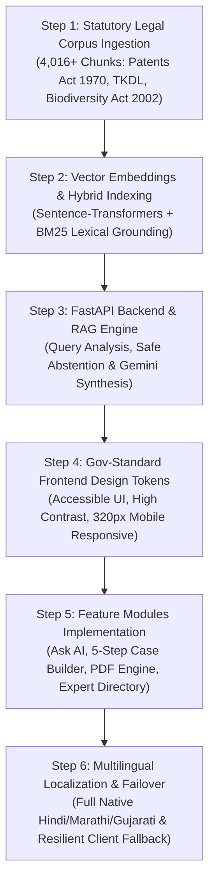
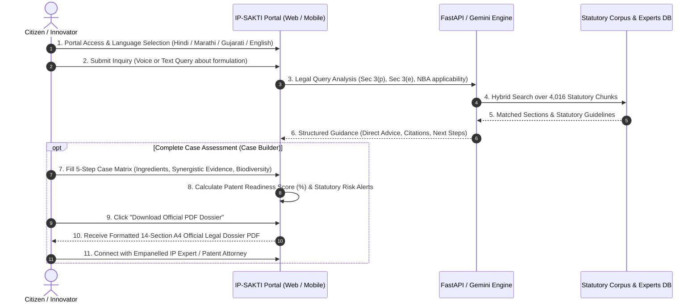

# IP-SAKTI Sahayak — Architecture, Tech Stack & Workflow Guide
**National Ayurveda Intellectual Property & Regulatory Guidance Portal**

---

## 1. Technology Stack (Overview Box)

```
┌────────────────────────────────────────────────────────────────────────────┐
│                    IP-SAKTI SAHAYAK — CORE TECH STACK                      │
├───────────────────────┬────────────────────────────────────────────────────┤
│ LAYER / CATEGORY      │ TECHNOLOGIES USED (Primary Tools)                  │
├───────────────────────┼────────────────────────────────────────────────────┤
│ 1. Frontend           │ • React 18 (TypeScript)                            │
│                       │ • Vite 6                                           │
│                       │ • Vanilla CSS (Gov-Standard Design System Tokens)  │
├───────────────────────┼────────────────────────────────────────────────────┤
│ 2. Backend            │ • FastAPI (Python 3.12)                            │
│                       │ • Uvicorn (ASGI Production Server)                 │
│                       │ • Pydantic v2 (Strict Schema Validation)           │
├───────────────────────┼────────────────────────────────────────────────────┤
│ 3. Database & Vectors │ • Supabase (Managed PostgreSQL)                    │
│                       │ • pgvector / ChromaDB (Vector Store)               │
├───────────────────────┼────────────────────────────────────────────────────┤
│ 4. AI / LLM & Search  │ • Google Gemini (1.5 Flash / Pro API)              │
│                       │ • Sentence-Transformers (all-MiniLM-L6-v2)         │
│                       │ • Rank-BM25 (Hybrid Semantic + Keyword Search)     │
├───────────────────────┼────────────────────────────────────────────────────┤
│ 5. APIs & Services    │ • Supabase Auth & REST API                         │
│                       │ • Web Speech API (Native Indian Voice Input)       │
├───────────────────────┼────────────────────────────────────────────────────┤
│ 6. Hosting & Cloud    │ • Vercel (Frontend Single Page Application)        │
│                       │ • Render (FastAPI Production Web Service)          │
└───────────────────────┴────────────────────────────────────────────────────┘
```

---

## 2. Methodology (Step-by-Step System Architecture)

The system was engineered following a 6-phase statutory and technical pipeline:



### Step 1: Statutory Legal Corpus Curation & Chunking
- Ingested primary legal statutes:
  - **Indian Patents Act, 1970** (Specifically Sections 2(1)(j), 3(p) for Traditional Knowledge, 3(e) for Mere Admixtures, 3(d) for Known Substances).
  - **Biological Diversity Act, 2002** (Section 6 approvals via National Biodiversity Authority / SBB).
  - **TKDL (Traditional Knowledge Digital Library)** and official Ayurvedic Pharmacopoeia guidelines.
- Preprocessed into 4,016+ structured statutory chunks with authority weights and legal citations.

### Step 2: Vector Embeddings & Hybrid Indexing
- Embedded statutory chunks using `Sentence-Transformers` (`all-MiniLM-L6-v2`).
- Combined dense vector embeddings with sparse `Rank-BM25` keyword indexing to guarantee that specific section references (e.g. "Section 3(p)", "Form 1", "Rule 55") are retrieved with zero hallucination.

### Step 3: FastAPI Backend & RAG Engine
- Built production FastAPI endpoints (`/api/v1/query`, `/api/v1/cases`).
- Implemented **Safe Abstention Gateways**: If user queries are ambiguous or lack facts, the engine abstains safely instead of guessing.
- Grounded prompt synthesis via Google Gemini, enforcing output in user-requested languages (Hindi, Marathi, Gujarati, English).

### Step 4: Government Design System & Responsive Foundation
- Built a custom Vanilla CSS design token system aligned with national portal standards (Ashoka Pillar motif, Tri-color accents, high legibility typography).
- Responsive matrix tested across 320px (compact mobile) to 4K resolutions with zero horizontal overflow.

### Step 5: Core Domain Modules Implementation
- **Ask AI Sahayak**: Real-time legal assessment with speech-to-text voice input.
- **5-Step Case Builder**: Step-by-step IP evaluation matrix (Formulation info, Traditional Knowledge novelty, Synergistic bio-assay evidence, Entity category, Commercialization).
- **Official Case Dossier PDF Engine**: Standardized A4 downloadable and printable dossier with 14 statutory sections.
- **Empanelled Expert Directory**: Verified directory of Ayurveda patent attorneys, scientists, and regulatory consultants.

### Step 6: Multilingual Localization & Zero-Downtime Fallback
- Localized into English, Hindi, Marathi, Gujarati, Kannada, and Sanskrit.
- Added a client-side statutory fallback engine: If the cloud server is warming up or slow, the portal generates instant grounded guidance directly in the browser.

---

## 3. User Workflow (End-to-End Innovator Journey)

The journey of an Ayurvedic researcher, MSME founder, or innovator using the portal:



### Detailed Workflow Stages:
1. **Access & Personalization**: User opens the portal on web or mobile and picks their preferred language.
2. **Interactive Legal Inquiry**: User asks questions (via typing or voice) such as patentability of herbal mixtures.
3. **Statutory Grounding**: The portal explains whether the invention risks rejection under Section 3(p) (traditional knowledge) or Section 3(e) (mere admixture) and provides exact statutory citations.
4. **Case Formulation**: Innovators fill out the 5-step Case Builder to test synergy data and biological resource compliance.
5. **Official Dossier Export**: The platform compiles a formal 14-section compliance report ready to save as an official PDF or print for official filing.
6. **Expert Consultation**: Innovators can browse empanelled IP attorneys and Ayurveda patent experts directly from the directory to proceed with legal representation.
